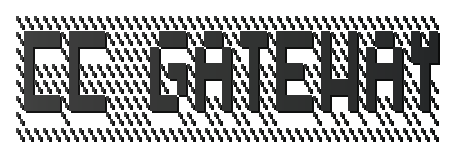

<div align="center">
  <picture>
    <source media="(prefers-color-scheme: dark)" srcset=".github/logo-dark.svg">
    <source media="(prefers-color-scheme: light)" srcset=".github/logo-light.svg">
    
  </picture>

  <p>Privacy-preserving Claude Code gateway with standalone, daemon, CLI, and desktop workflows</p>
</div>

<div align="center">

[![License: MIT][license-shield]][license-url]
[![Version][version-shield]][version-url]

</div>

<div align="center">
  <a href="#quick-start">Quick Start</a> &middot;
  <a href="#usage-paths">Usage Paths</a> &middot;
  <a href="#configuration-model">Configuration</a> &middot;
  <a href="#validation">Validation</a> &middot;
  <a href="#repo-layout">Repo Layout</a>
</div>

---

> **Acknowledgement** — This project originated from and pays tribute to [motiful/cc-gateway](https://github.com/motiful/cc-gateway). This repository extends that work with a Rust-first daemon and core, a local launcher, a Tauri desktop app, and a standalone bootstrap CLI.

> **Current focus** — `cc-gateway-desktop` is now a brownfield monorepo: the original TypeScript gateway remains as the behavioral reference, while the Rust daemon, Rust launcher, desktop UI, and standalone CLI are the long-term operator surfaces.

> **Disclaimer** — See [full disclaimer](#disclaimer) below.

## Why

Claude Code sends rich device, environment, and process telemetry upstream. If you use Claude Code across multiple machines, there is no built-in operator control over how that identity is presented.

CC Gateway provides one controllable layer between Claude Code and Anthropic. It lets operators define a canonical identity and runtime profile, centralize OAuth lifecycle handling, and route local or remote Claude Code sessions through a single managed gateway.

## What this repository includes now

This repository is no longer only the original Node reverse proxy. It currently contains five major surfaces:

1. **Standalone bootstrap CLI (`standalone-cli/`)**
   Published as `ccgw`, this is the easiest local entry point. It discovers Claude credentials, prepares a local standalone workspace, ensures a healthy runtime, and launches `claude` with the gateway environment.

2. **Rust daemon (`crates/daemon/`)**
   The production-oriented HTTP/TLS reverse proxy that loads `config.yaml`, rewrites requests, manages OAuth refresh, and exposes health information.

3. **Rust launcher CLI (`crates/cli/`)**
   The local `ccg` command for launcher-style flows such as `status`, `hijack`, `release`, and direct Claude launches through the gateway.

4. **Desktop app (`crates/desktop/`)**
   A Tauri + React operator UI for daemon status, config inspection/editing, logs, notifications, and desktop preferences such as autostart/start-minimized.

5. **TypeScript reference gateway (`src/`, `scripts/`)**
   The original implementation remains in-tree as a working reference and compatibility surface. Scripts such as `quick-setup.sh` and `add-client.sh` still support legacy/manual bootstrap flows.

## Features

- **Canonical identity rewriting** for device ID, email, account/session identifiers, and request metadata
- **Canonical environment replacement** for platform, architecture, Node version, terminal, package managers, CI flags, deployment environment, and related runtime fields
- **System prompt sanitization** for the injected `<env>` block (`Platform`, `Shell`, `OS Version`, `Working directory`)
- **Process telemetry normalization** for constrained memory and runtime heap/RSS ranges
- **Header rewriting and stripping**, including billing-header removal and other leak-prone fields
- **Centralized OAuth lifecycle management** so the gateway owns token refresh rather than every client machine
- **Standalone local bootstrap flow** via `ccgw`, including reusable workspace artifacts under `~/.ccgw/standalone-cli/`
- **Launcher-based client flows** via `ccg` and generated launchers that forward all normal Claude arguments
- **Desktop operator workflow** for config review, daemon health, logs, notifications, and local preferences
- **Remote/self-hosted deployment support** through shared config, client tokens, optional TLS, and daemon health endpoints
- **Brownfield parity path** where the TypeScript implementation remains available while the Rust-first path becomes the long-term product surface

## Quick Start

### Option A — Standalone CLI (recommended for local use)

Install the published bootstrap CLI:

```bash
npm install -g ccgw
ccgw
```

On first run, `ccgw` will:

1. Discover local Claude credentials
2. Create the standalone workspace under `~/.ccgw/standalone-cli/`
3. Write operator-visible artifacts such as `manifest.json`, `config.yaml`, and `runtime.json`
4. Prepare or reuse a healthy local runtime
5. Launch the locally installed `claude` binary with gateway environment variables

Useful subcommands:

```bash
ccgw discover-credentials
ccgw prepare-runtime
ccgw --help
ccgw --print "hello"
```

The standalone operator guide lives in [`standalone-cli/README.md`](standalone-cli/README.md).

### Option B — Desktop app (recommended for local operators who want a UI)

From the repository root:

```bash
cargo build --workspace
npm --prefix crates/desktop install
npm --prefix crates/desktop run tauri dev
```

The desktop app expects a `ccgw-daemon` binary either in the workspace build output (`target/debug/ccgw-daemon`) or on `PATH`. It uses `~/.ccgw/config.yaml` by default and writes desktop log output to `~/.ccgw/logs/desktop-daemon.log`.

### Option C — Manual / legacy script flow

If you want the original bootstrap path that writes a local `config.yaml` and generates client launchers:

```bash
npm install
bash scripts/quick-setup.sh
```

Then add more launcher scripts as needed:

```bash
bash scripts/add-client.sh alice
bash scripts/add-client.sh bob
```

This path remains useful for manual or legacy operator flows, but it reflects the TypeScript reference implementation rather than the newer standalone or desktop-first flows.

## Usage Paths

### 1) Standalone `ccgw`

Use `ccgw` when you want one self-contained local operator flow:

```bash
ccgw
ccgw discover-credentials
ccgw prepare-runtime
ccgw [claude args]
```

Behavior summary:

- discovers or reuses Claude credentials
- maintains stable workspace state in `~/.ccgw/standalone-cli/`
- re-renders config/runtime state instead of creating duplicate bootstrap artifacts
- prepares the gateway runtime before launching `claude`

### 2) Local launcher `ccg`

Use `ccg` when you already have a configured gateway and want a launcher-oriented workflow:

```bash
ccg
ccg status
ccg hijack
ccg release
ccg native --help
```

`ccg` is the Rust launcher surface in `crates/cli/`. It is designed for local install/uninstall, status checks, shell aliasing, and launching Claude Code through a configured gateway endpoint.

### 3) Daemon-only runtime

Use the Rust daemon directly when you want an explicit config-driven server process:

```bash
cargo run -p ccgw-daemon -- config.yaml
```

If you omit the config path, the daemon defaults to `config.yaml` in the working directory.

### 4) Desktop operator UI

Use the desktop app when you want a visual control surface for:

- daemon health and startup state
- config file inspection/editing
- log viewing and filtering
- desktop preferences such as autostart and start minimized
- visibility into canonical profile, OAuth presence, launcher availability, and proxy-related summary data

## Configuration Model

The main config contract is still YAML-based.

Start from:

- [`config.example.yaml`](config.example.yaml)
- [`config/canonical-profile.example.json`](config/canonical-profile.example.json)
- [`config/canonical-profile.schema.json`](config/canonical-profile.schema.json)

Key model concepts:

- `server` — local bind port and optional TLS cert/key paths
- `upstream` — Anthropic API upstream URL
- `oauth` — access token, refresh token, and expiry tracking managed by the gateway
- `auth.tokens` — per-client tokens for launcher/client authentication
- `identity` — canonical device/user identifiers
- `env` — canonical environment fingerprint
- `prompt_env` — prompt-visible environment values
- `process` — canonical memory and runtime metric ranges
- `canonical_profile_path` — optional external JSON profile that overrides inline identity/env/prompt/process sections

Common runtime paths used by the current repo:

- `~/.ccgw/config.yaml` — default desktop config path
- `~/.ccgw/logs/desktop-daemon.log` — default desktop-managed daemon log path
- `~/.ccgw/desktop-settings.json` — desktop settings
- `~/.ccgw/standalone-cli/manifest.json` — standalone workspace manifest
- `~/.ccgw/standalone-cli/runtime.json` — standalone runtime state

## Validation

Use the validation command that matches the surface you changed:

```bash
npm test                              # TypeScript reference gateway tests
cargo test                            # Rust workspace tests
npm --prefix standalone-cli test      # standalone bootstrap CLI validation
npm --prefix crates/desktop test      # desktop frontend tests
```

Useful build commands:

```bash
npm run build
cargo build --workspace
npm --prefix standalone-cli run build
npm --prefix crates/desktop run build
```

## Repo Layout

```text
src/                         TypeScript reference gateway
scripts/                     Legacy/manual bootstrap scripts
tests/                       TypeScript reference tests
standalone-cli/              Published standalone bootstrap CLI (`ccgw`)
crates/core/                 Shared Rust config, OAuth, logging, rewrite logic
crates/daemon/               Rust gateway daemon (`ccgw-daemon`)
crates/cli/                  Rust launcher CLI (`ccg`)
crates/desktop/              React/Tauri desktop app
config/                      Canonical profile examples and schema
docs/                        Supporting docs and design notes
```

## Caveats

- The repository still carries both TypeScript and Rust gateway implementations, so behavior parity matters.
- Official MCP-related traffic may still require separate handling because some upstream endpoints do not follow `ANTHROPIC_BASE_URL`.
- The desktop app and standalone CLI improve local operator experience, but they do not eliminate the need to review config, credentials, and deployment boundaries carefully.

## References

This repository builds on and extends:

- [motiful/cc-gateway](https://github.com/motiful/cc-gateway)
- [cc-cache-audit](https://github.com/motiful/cc-cache-audit)
- [instructkr/claude-code](https://github.com/instructkr/claude-code)

## Disclaimer

This project is for educational and research purposes only.

- Do NOT use this to share accounts or violate Anthropic's Terms of Service
- Do NOT use this for commercial abuse
- Review your deployment, credential handling, and exposure model carefully
- Use at your own risk

## License

[MIT](LICENSE)

---

<div align="center">
  <sub>Crafted with <a href="https://github.com/anthropics/claude-code">Claude Code</a></sub>
</div>

<!-- Badge references -->
[license-shield]: https://img.shields.io/github/license/KwokJay/cc-gateway-desktop
[license-url]: https://github.com/KwokJay/cc-gateway-desktop/blob/main/LICENSE
[version-shield]: https://img.shields.io/badge/version-0.3.0--alpha-blue
[version-url]: https://github.com/KwokJay/cc-gateway-desktop/releases
